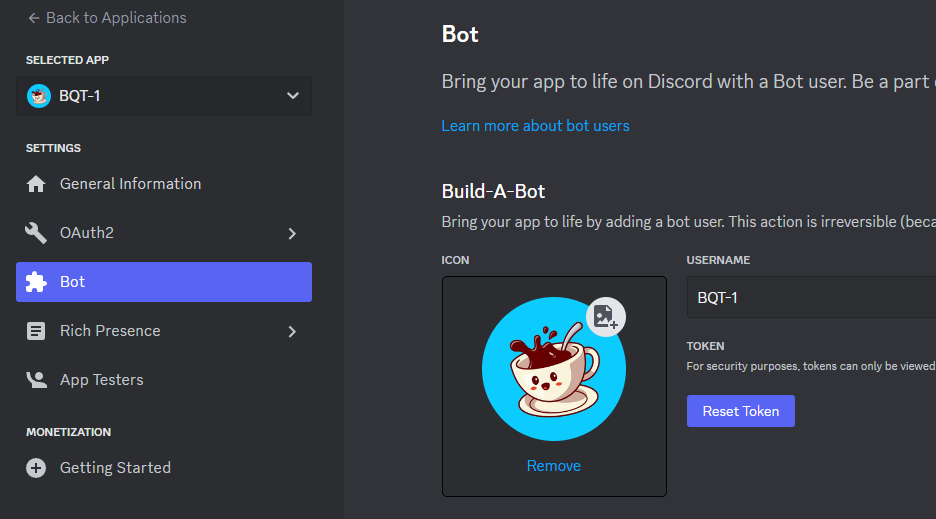
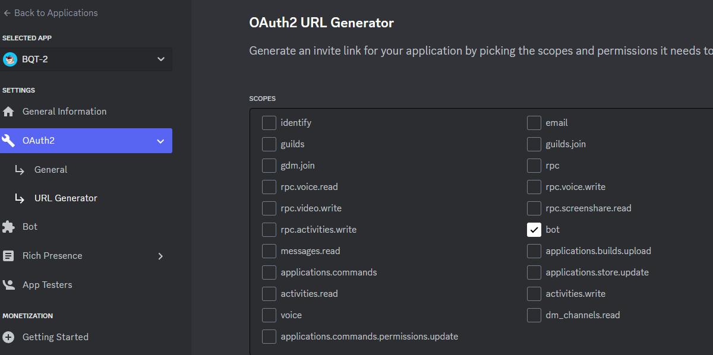

# discord-driven-action
Do some actions when you receive messages in Discord.

Group link
https://discord.gg/9KzCxR8JZs

## Create a Bot in Discord
1. Navigate to the Discord Developer Portal at https://discord.com/developers/applications.
2. Click on New Application.
3. After creating your new application, go to the "Bot" tab and click Add Bot.
4. You will see a token for your new bot. Click on Reset Token to generate a new one, and make sure to save it securely in your configuration file.

## Add Bot to a Server
1. In the Discord Developer Portal, navigate to the OAuth2 tab and then to URL Generator.
2. Under SCOPES, select bot.
3. Without adding any additional permissions, scroll down and click Copy to copy the generated URL.
4. Share the copied URL with the person responsible for adding the bot to the server, or use it yourself to add the bot to your Discord server.

